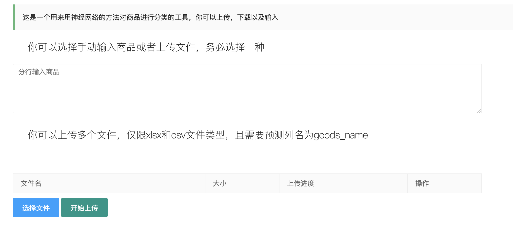
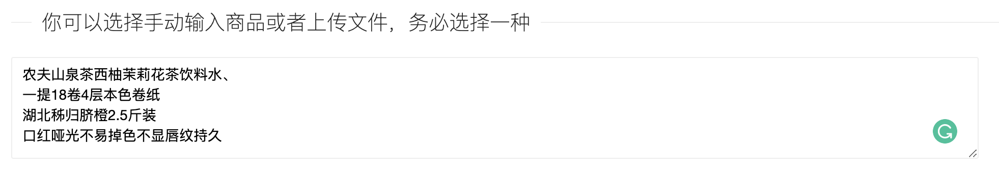
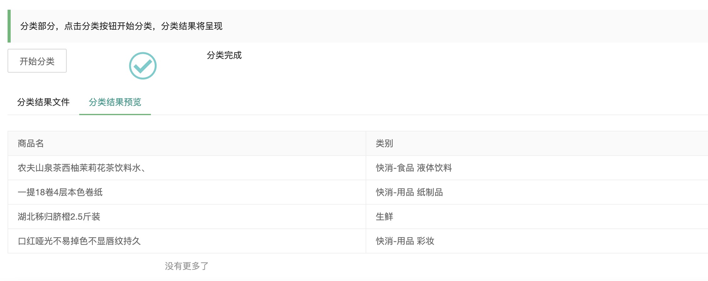

# Commodity Classification Webapp

#### Description

User can input some text in the input box or upload several files waiting to classify. The app can classify the specific commodity into more than 100 categories spaning from food to non food.

#### Language

Chinese

#### Technology

Web Framework: Flask

Classification Mode: Tensorflow, Convolutional Neural Network

#### Performance Screenshots

- Input section
  
  

- Input example
  
  

- Output example
  
  

---

*No Allowing For any Business Use*

Author: **@makethedayunique**
